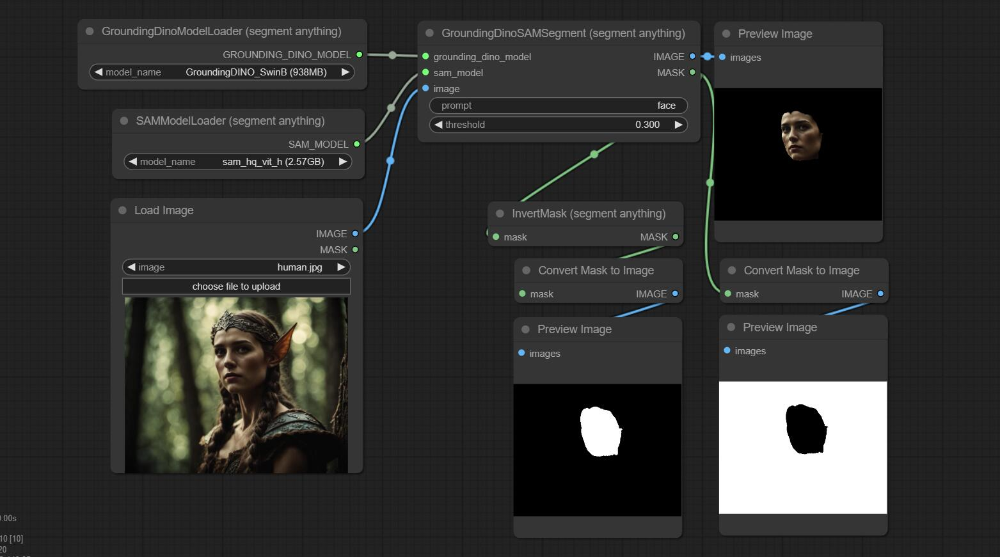

# ComfyUI Segment Anything

This project is a ComfyUI version of
`https://github.com/continue-revolution/sd-webui-segment-anything`. At present, only the most core functionalities have been implemented. I would like to express my gratitude to [continue-revolution](https://github.com/continue-revolution) for their preceding work on which this is based.



I have ensured consistency with `sd-webui-segment-anything` in terms of output when given the same input.

## Requirements

Please ensure that you have installed Python dependencies using the following command:
```
pip3 install -r requirements.txt
```

## Models

The models will be automatically downloaded when used. You can also manually download them according to the table below. If the automatic download is slow, you can set the `HTTP_PROXY` and `HTTPS_PROXY` environment variables to use a proxy.

### bert-base-uncased

You can download the model from https://huggingface.co/bert-base-uncased/tree/main into the `models/bert-base-uncased` folder located in the root directory of ComfyUI, like this:

```
ComfyUI
    models
        bert-base-uncased
            config.json
            model.safetensors
            tokenizer_config.json
            tokenizer.json
            vocab.txt
```

You can also skip this step. During the inference process, `bert-base-uncased` will be automatically downloaded through the `transformers` library, and its directory is typically `~/.cache/huggingface/hub/models--bert-base-uncased`.

### GroundingDino

Please directly download the models and configuration files to the `models/grounding-dino` directory under the ComfyUI root directory, without modifying the file names.

| name | size | config file | model file |  
|-|-|-|-|
| GroundingDINO_SwinT_OGC | 694MB | [download link](https://huggingface.co/ShilongLiu/GroundingDINO/resolve/main/GroundingDINO_SwinT_OGC.cfg.py) | [download link](https://huggingface.co/ShilongLiu/GroundingDINO/resolve/main/groundingdino_swint_ogc.pth) |
| GroundingDINO_SwinB | 938MB | [download link](https://huggingface.co/ShilongLiu/GroundingDINO/resolve/main/GroundingDINO_SwinB.cfg.py) | [download link](https://huggingface.co/ShilongLiu/GroundingDINO/resolve/main/groundingdino_swinb_cogcoor.pth) |

### SAM

Please directly download the model files to the `models/sams` directory under the ComfyUI root directory, without modifying the file names.

| name | size | model file |
|-|-|-|  
| sam_vit_h | 2.56GB |[download link](https://dl.fbaipublicfiles.com/segment_anything/sam_vit_h_4b8939.pth) |
| sam_vit_l | 1.25GB |[download link](https://dl.fbaipublicfiles.com/segment_anything/sam_vit_l_0b3195.pth) |
| sam_vit_b | 375MB |[download link](https://dl.fbaipublicfiles.com/segment_anything/sam_vit_b_01ec64.pth) |  
| sam_hq_vit_h | 2.57GB |[download link](https://huggingface.co/lkeab/hq-sam/resolve/main/sam_hq_vit_h.pth) |
| sam_hq_vit_l | 1.25GB |[download link](https://huggingface.co/lkeab/hq-sam/resolve/main/sam_hq_vit_l.pth) |
| sam_hq_vit_b | 379MB |[download link](https://huggingface.co/lkeab/hq-sam/resolve/main/sam_hq_vit_b.pth) |
| mobile_sam | 39MB |[download link](https://github.com/ChaoningZhang/MobileSAM/blob/master/weights/mobile_sam.pt) |


## Contribution

Thank you for considering to help out with the source code! Welcome contributions from anyone on the internet, and are grateful for even the smallest of fixes!

If you'd like to contribute to this project, please fork, fix, commit and send a pull request for me to review and merge into the main code base.